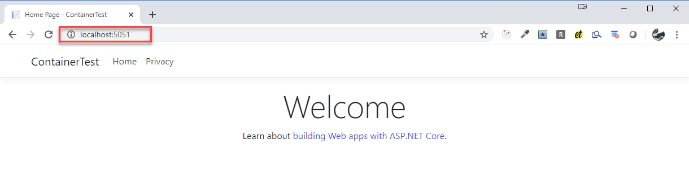
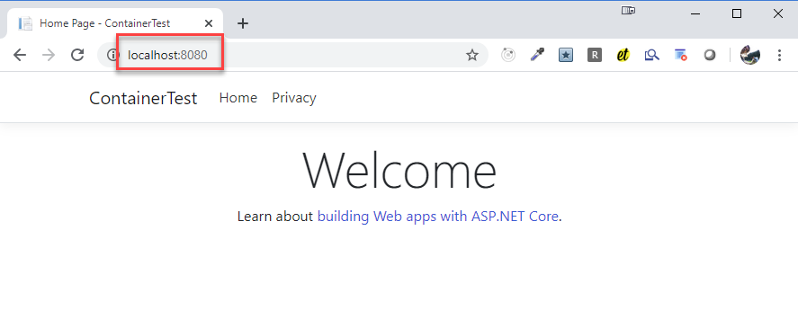

# Docker & Kubernetes Advanced Test

## Docker

Build und Run Local Docker Image:

```
cd ContainerTest
docker build --rm -f "dockerfile" -t containertest .
docker run -it --rm -p 5051:80 containertest
```

Open Browser on URL:

```
http://localhost:5051
```

> Note: As an alternative you can run my containertest image that i uploaded to Docker Hub using: `docker run -it --rm -p 5051:80 arambazamba/containertest`

If you see this the test passed:



## Kubernetes

Go to the folder where `containertest.yaml` is located:

Create a Deployment:

```
kubectl create deployment containertest --image arambazamba/containertest
```

Expose using a Service:

```
kubectl expose deployment containertest --type=LoadBalancer --port=8080
```

Forward the port to Service

```
kubectl port-forward pods/containertest-579777cf8b-sxw7n 8080:80 -n default
```

> Note: You can copy the pod name if you have install the [Kubernetes VS Code Extension](https://marketplace.visualstudio.com/items?itemName=ms-kubernetes-tools.vscode-kubernetes-tools)


You should see the following result



Cleanup:

```
kubectl delete service containertest
kubectl delete deployment containertest
```
