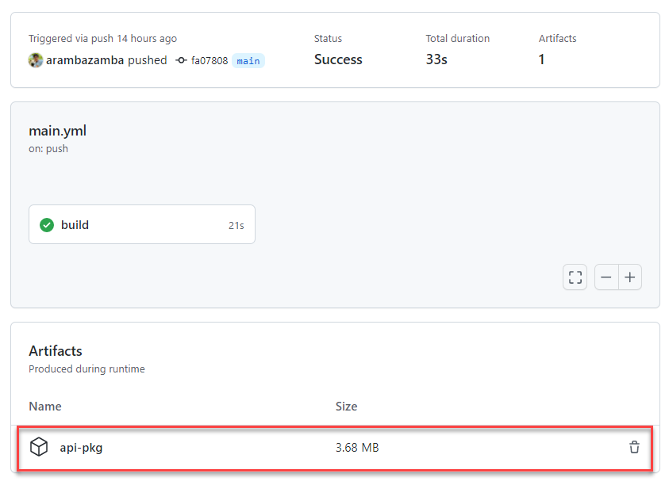

# GitHub Flow & Actions

[GitHub Actions Documentation](https://docs.github.com/en/actions)

[GitHub Actions](https://github.com/actions)

## Demos

Navigate to this repo [https://github.com/arambazamba/actions-api](https://github.com/arambazamba/actions-api)

- Explain .NET Core Api in short 
- Explain `.github/workflows/main.yml` and execute it
- Show api-pkg

    

- Show [GitHub Actions Marketplace](https://github.com/marketplace)
- Give Overview over [Azure Actions](https://github.com/marketplace?category=deployment&query=azure+)