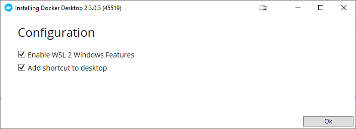
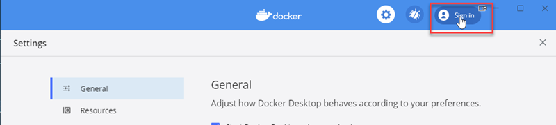
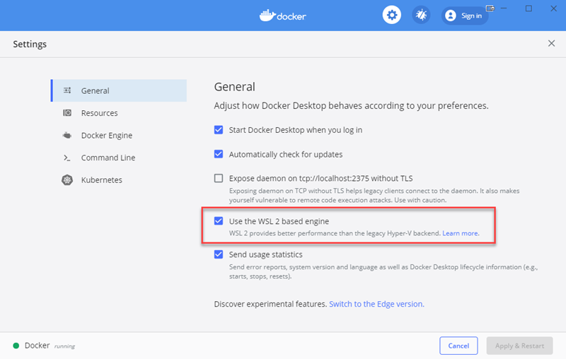
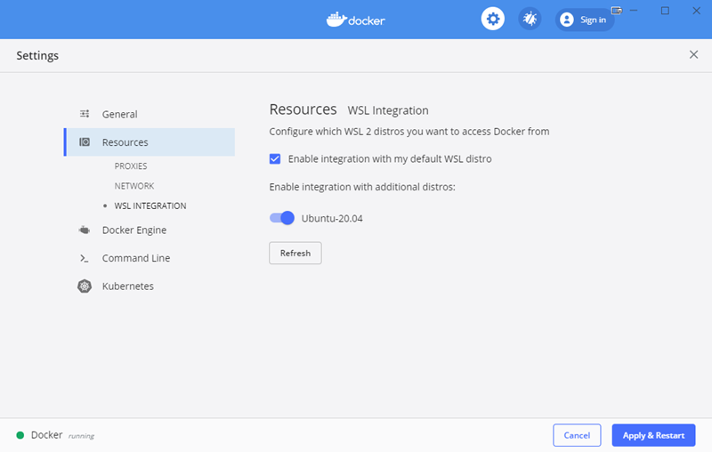
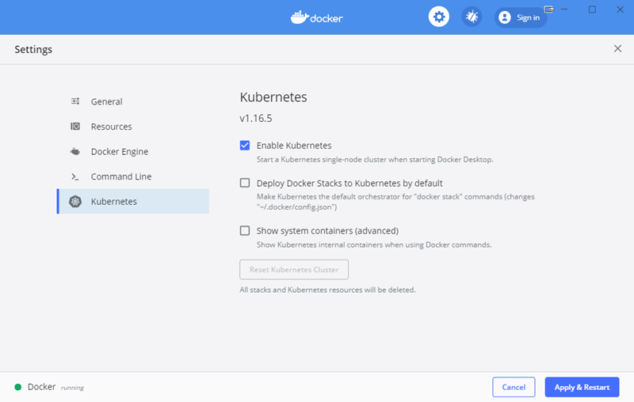
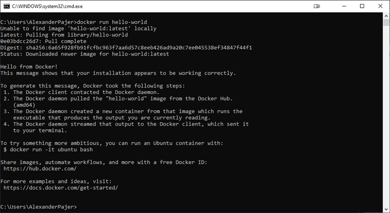

# Docker & Kubernetes

Docker Desktop for Windows can use [Hyper-V](https://docs.docker.com/docker-for-windows/install/) or WSL 2. This Guid is asuming that you choose to use WSL 2. A Guide for installing WSL 2 can be found [here](wsl.md)

## Installation

Install Docker Desktop:

[Docker Desktop](https://hub.docker.com/editions/community/docker-ce-desktop-windows)



Signin to Docker



Configure Cocker:





Enable Kubernetes:



Press Appy & Restart to complete Docker Setup

## Test Installation

In the console window execute:

```
docker run hello-world
```



> Note: An advanced Docker & Kubernetes Test can be found [here](../containers/readme.md)

## Using Containers

- Use [Food App](https://github.com/ARambazamba/food-app) to demonstrate containers

