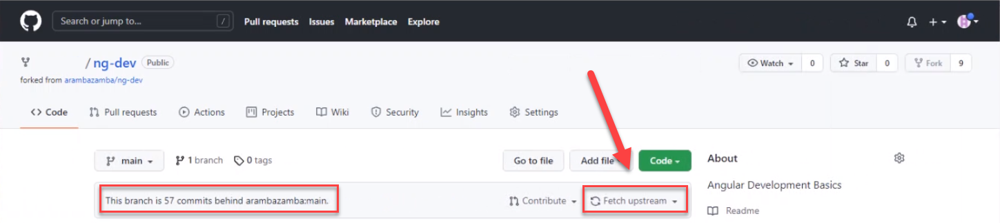

# Lab Setup Guide

- [Create Azure Lab Virtual Machine (optional)](#labvm)
- [Install required class software](#software)
- [Fork & Clone Class Repo and configure GitHub requirements](#fork)

## Create Azure Lab Virtual Machine - optional<a id='labvm'>

Execute `create-lab-vm.sh` or run the following remote script in Cloud Shell

```bash
curl https://raw.githubusercontent.com/arambazamba/web-adv/master/Setup/create-lab-vm.sh | bash
```


> Note: In order for Docker to work on a Windows 10 host you need to install Hyper-V or use Windows Subsystem for Linux 2 (WSL2). A detailed Setup Guide can be found [here](https://github.com/ARambazamba/ClassSetup)

### Connect to VM

Go to Ressource Group `az-lab` and connect to VM using RDP and the credentials that you have used in the script:

Download RDP File:


Optional - Disable Login:


Sign In & Remember:


Credentials:

```
user=azlabadmin
pwd=Lab@dmin1233
```


Accept Settings:


## Install required class software<a id='software'>

To install an optimal software configuration run the script `setup-web-adv.ps1` from an elevated PowerShell prompt:


```powershell
Set-ExecutionPolicy Bypass -Scope Process -Force;
Invoke-Expression ((New-Object System.Net.WebClient).DownloadString('https://raw.githubusercontent.com/arambazamba/web-adv/master/Setup/setup-web-adv.ps1'))
```

It installs:

- [Chocolatey- THE PACKAGE MANAGER FOR WINDOWS](https://chocolatey.org/)
- [Basic Git Support](https://git-scm.com/downloads)
- [Visual Studio Code](https://code.visualstudio.com/) and basic extensions
- [Node Version Manager](https://github.com/coreybutler/nvm-windows) with Node 12.x and 14.x
- Several CLI's and Extensions

##Fork & Clone Class Repo and configure GitHub requirements<a id='fork'>

Set User and E-Mail in order to be able to commit to git:

```bash
git config --global user.name "Your Name"
git config --global user.email "your.email@yourdomain.com"
```

Go to [https://github.com/ARambazamba/web-adv](https://github.com/ARambazamba/web-adv) and fork the repo:


The [forking workflow](https://www.atlassian.com/git/tutorials/comparing-workflows/forking-workflow) allows you to commit your changes to your own fork of still get updates from the instructors repo:



Clone the class repo to your lab machine:

```bash
git clone https://github.com/Student01/ng-dev
```

> Note: If you have forked the class repo clone your own fork, otherwise use https://github.com/ARambazamba/ng-dev


